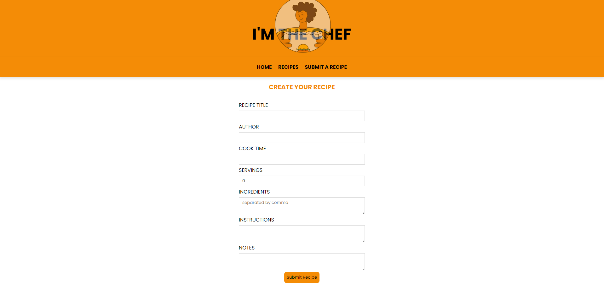
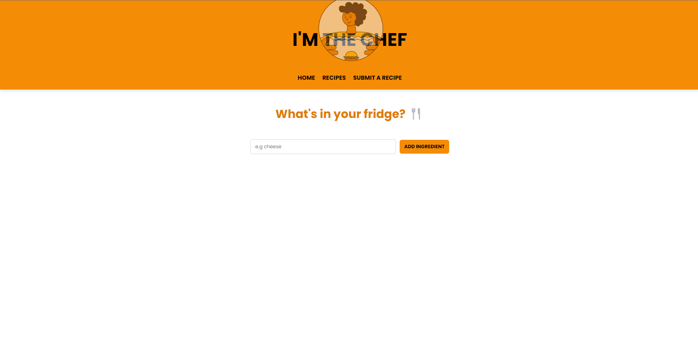
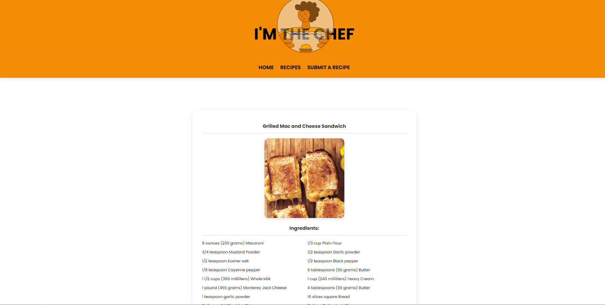

# 🧑‍🍳 I'M THE CHEF — Recipe Management Web App

## 📸 Demo

> [📺[ FrontEnd](https://imchef-frontend.onrender.com)]
Backend: https://imchef-backend.onrender.com/form

## 🚀 Features

- 🔎**What's in your fridge** — Generate a recipe based on your input of ingredients. 
- ✅ **Create Recipes** — Add title, author, ingredients, cook time, instructions, and more.
- ✏️ **Edit Recipes** —  Update any recipe with a single click
- 🗑️ **Delete Recipes** — Easily remove outdated or failed kitchen experiments.
- 👀 **View Details** — Full recipe detail page with ingredients and instructions.
- 🎨 **Styled with Custom CSS** — Clean, intuitive design with Flexbox + subtle transitions.
**Card-Based Display** — Consistent and scrollable recipe cards.

## ⚙️ Technical Functionality 

- **React** (Vite)
- **React Router DOM**
- **JavaScript (ES6+)**
- **Custom CSS**
- **React Icons**
- **RESTful API Integration**
- **Express**
-**NodeJs**
-**MongoDB**

---

## Backend Routes
| Endpoits      | Method        |Description    | 
| ------------- | ------------- | ------------- |
| /form         | GET           | All the recipes created by the user| 
| /form         | POST          | Create a new recipe |
| /form/:id     | GET           | Details about one recipe in specific | 
| /form/:id     | PUT           |Update information about a recipe | 
| /form/:id     | DELETE        |Delete a recipe| 

## 🧪 Future Improvements
📝 User authentication & saved recipes
📷 Upload photos per recipe

https://trello.com/b/PPIkmNqJ

